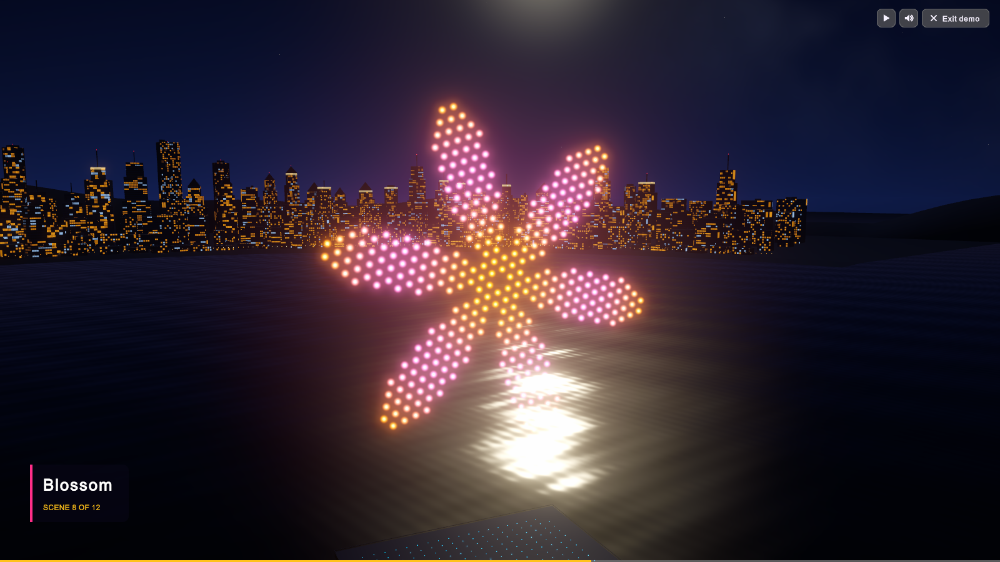
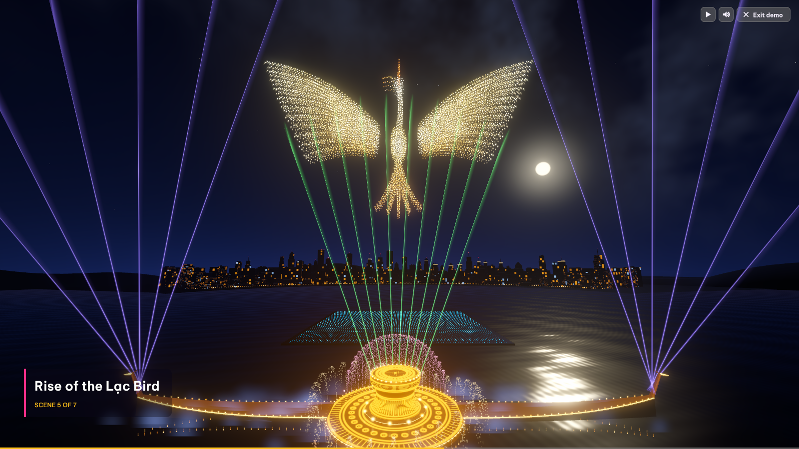
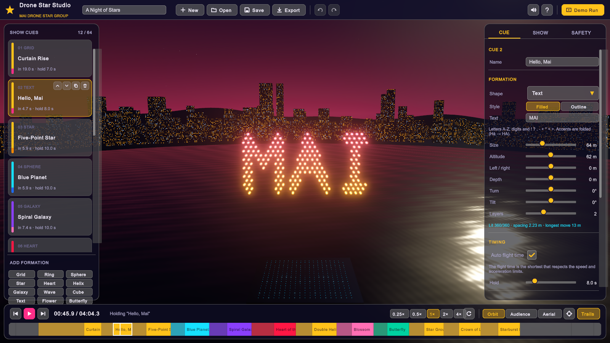
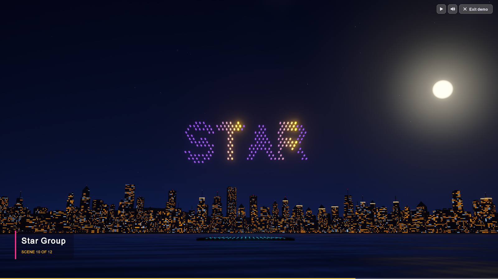
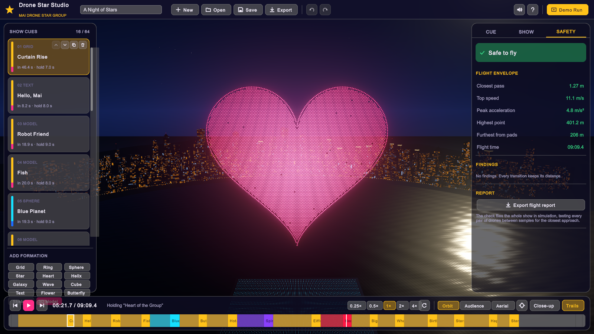
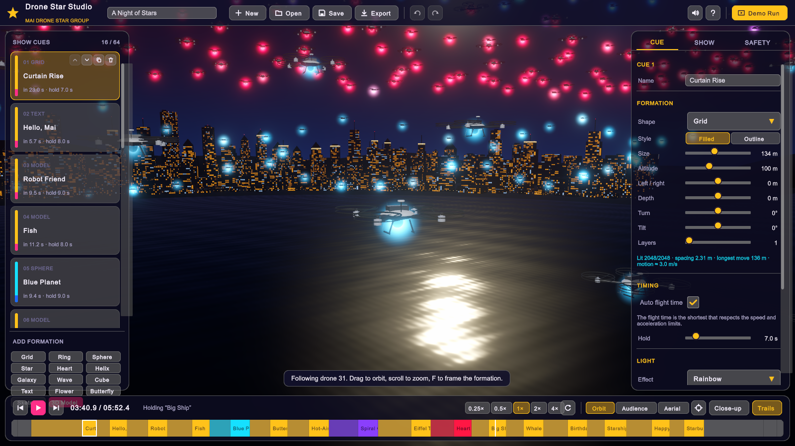
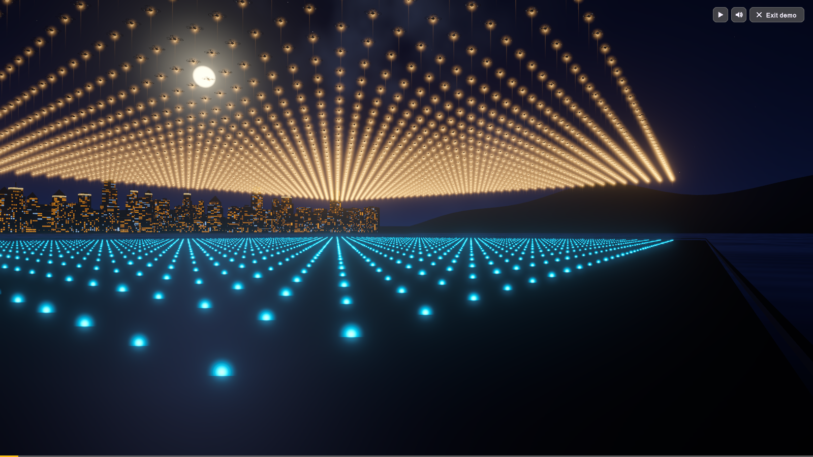
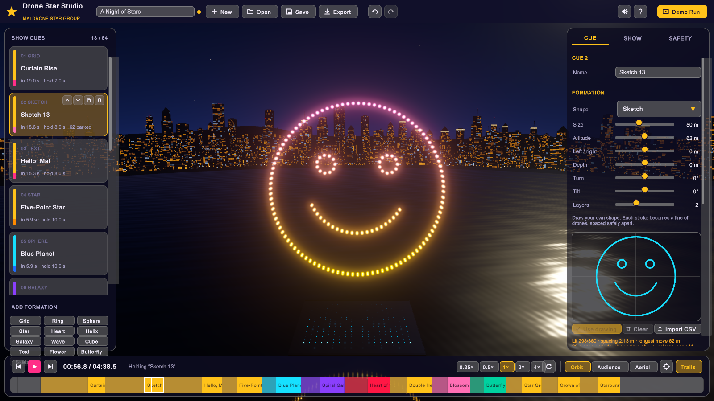

# Drone Star Studio

**Design, check and present drone light shows — built in Unity 6 for the Mai Drone Star Group.**

[**▶ Demo 1: A Night of Stars**](https://s0lluxx26.github.io/mai_drone_star_group/?demo=1) ·
[**▶ Demo 2: Rise of the Lạc Bird**](https://s0lluxx26.github.io/mai_drone_star_group/?demo=2) ·
[Open the studio](https://s0lluxx26.github.io/mai_drone_star_group/)



Drone Star Studio is a complete show editor for fleets of up to **8,192 drones**: lay out formations or
full-colour 3D models, colour them, give them motion, and the studio plans every flight path, checks the
whole show for safety, and plays it back over a dark blue night lake with reflections, light trails, a 3D
city skyline and a generated soundtrack. Every drone is a detailed quadcopter with a glowing LED bulb
underneath; fly the close-up camera beside one to watch its props spin as it leans into each move.
Press **Demo Run** to watch a demo, or your own show, as a cinematic presentation with titles, scene captions
and camera cuts. The second demo, *Rise of the Lạc Bird*, is a Đông Sơn festival: a golden Lạc bird of 8,192 drones
beats its wings above a bronze-drum stage, with fountains, an arched water screen, mist and lasers that follow the show.



| Editing a show | The demo run | Safety check |
|---|---|---|
|  |  |  |

| Close-up beside a drone | Launch from the pads | Sketch your own shape |
|---|---|---|
|  |  |  |

## What you can do

- **Fleets from 10 to 8,192 drones** — presets (256 · 512 · 1K · 2K · 4K · 8K) resize every shape, altitude,
  spin and limit to suit the fleet, or set any count with the slider. Drones must keep a safe distance, so
  a shape of a given size holds a fixed number of them: a bigger fleet draws bigger shapes in finer detail,
  and the cameras frame them accordingly. Phones open the flagship at 2,048 drones (the same show, a
  quarter of the per-frame work); 8K is one tap away in the Show tab.
- **14 full-colour 3D models** — robot, fish, butterfly, hot-air balloon, Eiffel Tower, ocean liner,
  whale, firework star, row of fire, birthday cake, starship launch and a greeting banner, ported from
  the [Draw_in_3D](https://github.com/S0lluxx26/Draw_in_3D) drone show, plus the studio's own Lạc bird (with wings
  that beat) and the face of a Đông Sơn bronze drum. Each keeps its own colours (the *Model
  colours* effect), draws the whole model at any fleet size, and is sized for your fleet when you add it.
  **Enlarge to light all** grows any shape until no drone is left parked.
- **12 formation families** — grid curtain, ring, sphere, star, heart, helix, spiral galaxy, wave, cube,
  text (A–Z, 0–9; accents such as *Hà* fold to *HA*), flower and butterfly — filled or outlined,
  with depth layers, turn/tilt, size and position.
- **Sketch** — draw your own shape with the mouse or a finger (each stroke becomes a line of drones), or
  import `x,y[,z]` points from a CSV file.
- **10 light effects** — solid, gradient, rainbow, chase, twinkle, pulse, radial, fire, model colours,
  off — from a vivid palette or any hex colour, with tempo and brightness.
- **Motion while holding** — turntable, roll, breathe, wave, rise and wingbeat (the Lạc bird's wings swing about
  its shoulders), eased in and out so drones never jerk.
- **Two venues** — the night lake, or the festival stage: a bronze drum on a sun-star platform with boat-shaped
  wings, fountains, mist and lasers, all choreographed from the show's timing and colours (the flight plan is the
  same either way).
- **Automatic flight planning** — every change is re-planned in the background: shortest legal
  transition times, optimal drone-to-slot matching and parking of surplus drones.
- **Safety check** — the whole show is flown in simulation: closest approach between every pair of
  drones, speed, acceleration, ceiling, ground clearance, geofence and battery time, with each
  finding one click away on the timeline.
- **Undo/redo**, save on the device (in the browser's storage on the web), import/export `.dronestar.json`, export per-drone
  **trajectories (CSV)** and a **flight report (Markdown)**.
- **Demo Run** — title card, a launch shot from among the pads, a camera shot per scene (some open beside a
  single drone and pull back to reveal the shape), captions, soundtrack and an end card.
- **Detailed drones** — the nearest drones are drawn as full quadcopters (shell, carbon arms, motors, prop
  guards, twisted blades that spin in flight, skids and the LED bulb that lights their belly); the rest use a
  light model, and each one leans into its direction of flight.

## How the flight planning works

1. **Formations with guaranteed spacing.** Each shape is sampled so neighbouring drones are at least
   √2 × the minimum separation apart (hexagonal lattices for filled shapes, arc-length sampling for
   outlines, parametric layouts for spheres, tori and cubes). Drones that do not fit park, dark,
   on a grid behind the shape instead of crowding it.
2. **Optimal assignment.** Between two formations, drones are matched to their new slots minimising the
   total *squared* distance: exactly with the Hungarian algorithm up to 600 drones, and above that with
   Bertsekas' ε-scaling auction followed by a pairwise-swap repair, which leaves no pair of drones that
   would be better off swapping slots (about 2 s for 8,192 drones, within 0.1 % of the optimum, spread over
   frames so the editor stays smooth). Layouts and assignments are cached, so editing one cue only re-lays
   that cue and re-solves the two transitions that touch it, and the built-in show ships pre-solved at 1K,
   2K, 4K and 8K drones (each baked entry records its cost, so a stale one is re-solved rather than
   trusted).
3. **Synchronised straight lines.** All drones leave and arrive together along straight lines with a
   minimum-jerk profile (zero velocity and acceleration at both ends). Swap-optimal assignment +
   synchronised straight lines + √2 spacing is the CAPT condition (Turpin, Michael & Kumar, 2014) that
   keeps transitions collision-free; it only needs every *pair* to be swap-optimal, which both solvers
   guarantee.
4. **Legal timing.** Auto transitions take the shortest time for which the peak speed
   (1.875·d/T) and peak acceleration (5.77·d/T²) stay inside the limits, plus 8 % head-room.
5. **Independent verification.** The safety check does not trust any of the above: it re-flies the
   compiled show at 20 Hz (10 Hz on the web and above 1,000 drones) and tests the closest approach of every nearby pair
   between samples.

The flagship demo, *A Night of Stars* (8,192 drones, 16 scenes, 9 min 9 s), passes with a closest pass
of 1.27 m against a 1.2 m limit, a top speed of 11.1 m/s against 12 m/s and peak acceleration of
4.8 m/s² against 5 m/s²; every smaller preset passes too (2,048 drones: 5 min 53 s, closest pass 1.28 m).
Demo 2 (8,192 drones, 7 scenes, 5 min 12 s) passes with a closest pass of 1.27 m and peak acceleration of
4.0 m/s². The original 360-drone show is still there as the *Classic Night* template.
See [docs/ARCHITECTURE.md](docs/ARCHITECTURE.md) for the design and [docs/REVIEW.md](docs/REVIEW.md) for
the review log.

## Using the studio

| | |
|---|---|
| **Left** | Show cues — select, reorder, duplicate, delete; add a formation or a **3D Model** at the bottom |
| **Right** | Inspector: **Cue** (shape or model, timing, light, motion), **Show** (fleet, limits, launch pad), **Safety** |
| **Bottom** | Transport, speed, loop, camera (orbit / audience / aerial / close-up), trails, timeline scrubber |

| Keys | Action |
|---|---|
| Space | Play / pause |
| ← → (Shift) | Step 1 s (5 s) |
| ↑ ↓ | Previous / next cue |
| Ctrl+Z / Ctrl+Y | Undo / redo |
| Ctrl+S | Save |
| Del | Delete the selected cue |
| F | Frame the selected formation |
| 1 / 2 / 3 | Orbit / audience / aerial camera |
| 4 | Close-up: follow a drone (again for a neighbour) |
| T | Light trails |
| D / Esc | Start / leave the demo run |
| Mouse | Drag to orbit, right-drag to pan, wheel to zoom |

## Project layout

```
Assets/DroneStar/
  Core/        Engine-free show model and algorithms (no UnityEngine references)
  Runtime/     Unity app: controller, renderer, venue, camera, demo director, UI, platform I/O
  Shaders/     URP shaders: LED glow + water reflections, night sky, lake, city windows, trails
  Editor/      ProjectBuilder: generates materials, post-processing, UI panel and the scene; builds
  Tests/       EditMode (core + project checks) and PlayMode (the running studio)
  Data/        ShapePack.bytes (3D models) and DemoAssignments.bytes (pre-solved flagship transitions)
  UI/          Studio.uss stylesheet and theme
Assets/WebGLTemplates/DroneStar/   Branded web loader
tests/         dotnet projects that compile Core and its tests outside Unity
tools/         export-shape-pack.mjs (models from a pinned Draw_in_3D commit + studio-models.mjs), publish-pages.ps1
docs/          Architecture notes and screenshots
```

## Building and testing

Requires **Unity 6000.6.3f1** (Unity 6.6) with Web and Windows build support, and the .NET 9 SDK
for the fast core tests.

```bash
# Core algorithms (under a minute, no Unity needed)
dotnet test tests/DroneStar.Core.Tests

# After changing the flagship, the formations or FormationGenerator.Revision: re-bake its transitions (~2 min)
dotnet test tests/DroneStar.Core.Tests --filter Name=BakeDemoAssignments

# Re-export the 3D models from a Draw_in_3D checkout next to this repository
node tools/export-shape-pack.mjs

# Regenerate materials, post-processing, UI panel and the scene
Unity -batchmode -quit -projectPath . -executeMethod DroneStar.EditorTools.ProjectBuilder.RebuildAll

# Unity test suites
Unity -batchmode -projectPath . -runTests -testPlatform EditMode -testResults editmode.xml
Unity -batchmode -projectPath . -runTests -testPlatform PlayMode -testResults playmode.xml

# Players
Unity -batchmode -quit -projectPath . -executeMethod DroneStar.EditorTools.ProjectBuilder.BuildWebGL -output Builds/WebGL
Unity -batchmode -quit -projectPath . -executeMethod DroneStar.EditorTools.ProjectBuilder.BuildWindows -output Builds/Windows/DroneStarStudio.exe
```

A Windows build can capture screenshots unattended:
`DroneStarStudio.exe -capture shots -captureTimes 20,60,c4 [-demo] [-captureCamera audience|aerial|closeup] [-captureLive]`
(`c4` = three seconds into scene 4's hold; `-captureLive` plays into each moment so drones lean and props turn).

### Unity MCP

The project includes [MCP for Unity](https://github.com/CoplayDev/unity-mcp) (`com.coplaydev.unity-mcp`),
so an MCP client such as Claude Code can drive the open editor: in Unity choose
**Window ▸ MCP for Unity ▸ Configure All Detected Clients**, or register it by hand with
`claude mcp add --scope local --transport http UnityMCP http://127.0.0.1:8080/mcp`.

## Show file format

Shows are plain JSON (`*.dronestar.json`, format tag `dronestar-show`, version 1): title, author,
drone count, safety limits, launch pad and an ordered list of cues, each with a formation (including the
`model` name for 3D models), light, motion and timing block. Files are validated and clamped on load;
unknown fields are ignored.

## License

MIT — see [LICENSE](LICENSE). The UI font, [Be Vietnam Pro](https://github.com/bettergui/BeVietnamPro), is under the
SIL Open Font License (`Assets/DroneStar/UI/Fonts/OFL.txt`).
